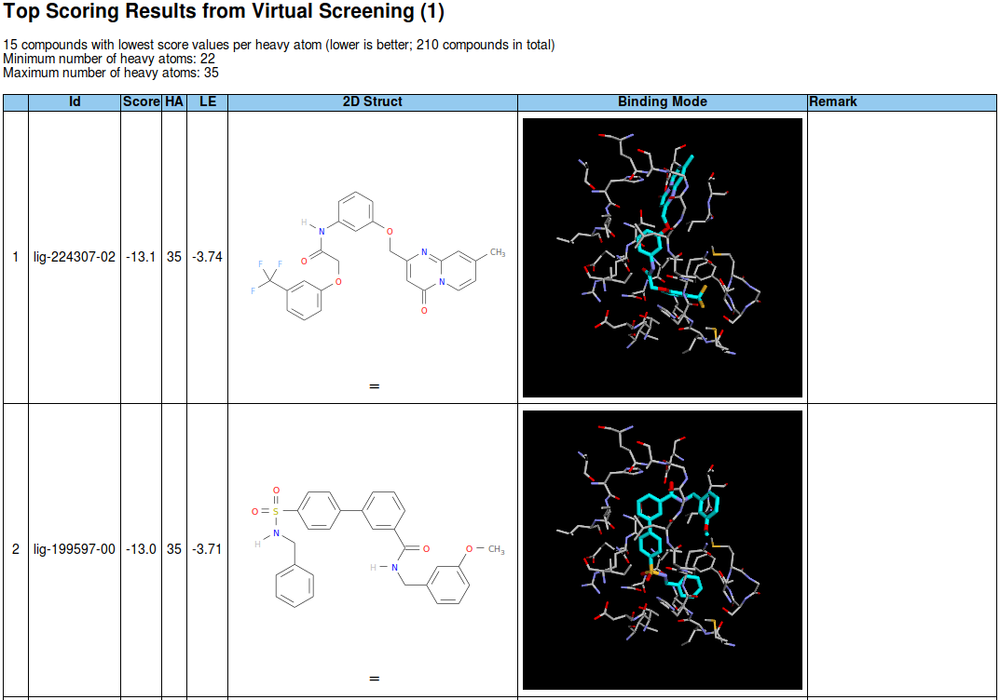

# vstools

Utilities for analyzing and reporting results from Smina virtual screens.

## Tools

The tools are written in Go and Bash.

### `smina_scan_logs` (Go)

`smina_scan_logs` scans smina log files for lowest scores or lowest ligand efficiencies with optional limits on heavy atom count (see `smina_scan_logs -h`). The tool copies the docking results that meet the criteria into a separate folder and creates a `scores.txt` summary file in the current dir.

### `smina_preprep` (Bash)

`smina_preprep` prepares a folder generated by `smina_scan_logs` for reporting.  
The generated scores.txt has to be put in the folder and a `as.pdb` containing the active site has to be present in the parent dir. `smina_preprep` has to be started **from within the dir** that `smina_scan_logs` created.

`smina_preprep` is a bash script that will not be directly executable when using the go tools (see below). After go-getting this repo, you can manually create a link to the file in one of your binary folders, e.g. 

    ln -s $GOPATH/src/github.com/apahl/vstools/scripts/smina_preprep.sh ~/bin/smina_preprep

### `smina_report` (Go)

`smina_report` creates HTML reports of the type shown below, where the binding site column is an interactive 3Dmol JS widget of the ligand in the active site (created by `smina_preprep` from the ligand `.pdbqt` file and the above mentioned `as.pdb`) that allows rotating and zooming. The ligands listed in scores.txt are shown in the report, optional remarks can be put in `scores.txt` at the end of each ligand line, separated by tab from the previous field.

## Example Report

[example file](http://htmlpreview.github.io/?https://github.com/apahl/vstools/master/res/report_01.html)

## Requirements

* [Smina](https://sourceforge.net/projects/smina/files/) by D. Koes et al.
* [Openbabel](http://openbabel.org/wiki/Category:Installation) (already available in most Linux repositories)
* [Go](https://golang.org/) >=v1.10.0

## Installation

`go get -u github.com/apahl/vstools/...`

For a tutorial on how to prepare the receptor and the ligands, see the excellent blog post [Ligand docking with Smina](https://www.wildcardconsulting.dk/useful-information/ligand-docking-with-smina/) by E.J. Bjerrum.

Example uses of the tools and additional scripts (including for running smina on a cluster (platform LSF)) can be found in the [smina](smina.md) file.

More detailed documentation will follow.
